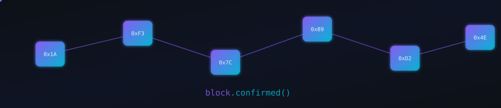
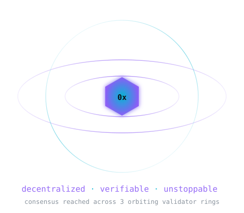

<div align="center">


<br/>

<a href="https://git.io/typing-svg">
  
</a>

<br/>

<p align="center">
  <a href="#about"></a>
  <a href="#tech-stack"></a>
  <a href="#featured-projects"></a>
  <a href="#github-stats"></a>
  <a href="#connect"></a>
</p>


</div>

<!-- 🔗 custom animated blockchain-network banner — commit the /assets folder alongside this README -->
<p align="center">
  
</p>

<p align="center">
  
</p>

<div align="center">


</div>

---

<a name="about"></a>

### 👋 About Me



```rust
struct RohitYadav {
    role: &'static str,
    chains: [&'static str; 4],
    focus: [&'static str; 3],
    currently_learning: &'static str,
    status: &'static str,
}

impl RohitYadav {
    fn new() -> Self {
        Self {
            role: "Blockchain Engineer & Rust Developer",
            chains: ["Solana", "Aptos (Move)", "Ethereum (Solidity)", "Stellar (Soroban)"],
            focus: ["Smart Contract Security", "Protocol Architecture", "DeFi Systems"],
            currently_learning: "Machine Learning",
            status: "shipping audited smart contracts, one block at a time ⛓️",
        }
    }
}

fn main() {
    let me = RohitYadav::new();
    println!("{:?}", me.status);
}
```

- 🔐 I design, build and harden **smart contracts** across Solana, Aptos (Move), and EVM chains — writing secure, gas-efficient logic that holds up on mainnet.
- ⛓️ Fascinated by how decentralization brings transparency and trustless guarantees to real-world systems — from on-chain program logic to full protocol architecture.
- 🧠 Currently expanding into **Machine Learning** — model training and exploring where AI meets decentralized systems.
- 🚀 Driven by curiosity, my goal is to contribute to meaningful Web3 + AI projects and keep pushing technical boundaries.
- 🙏 **ऊँ गणेशाय नमः**

<br clear="right"/>

---

### ⚡ Live Deploy Log

<p align="center">
  
</p>

---

<a name="tech-stack"></a>

### 💻 Tech Stack

<p align="center">
  
</p>

<details>
<summary>🔍 Full breakdown by category</summary>
<br>

**Blockchain & Smart Contracts**

     

**Languages**

   

**Frontend & Frameworks**

      

**Data, ML & Cloud**

        

**Databases & Tools**

     

</details>

---

<a name="featured-projects"></a>

### 🚀 Featured Projects

<p align="center"><sub>Live cards pulled straight from my GitHub repos — stars & descriptions stay in sync automatically.</sub></p>

<table align="center">
<tr>
<td><a href="https://github.com/R0hit-Yadav/Web3_Rust_X_Blockchain"></a></td>
<td><a href="https://github.com/R0hit-Yadav/Move_Aptos"></a></td>
</tr>
<tr>
<td><a href="https://github.com/R0hit-Yadav/Solana_Token"></a></td>
<td><a href="https://github.com/R0hit-Yadav/Soroban_Integration"></a></td>
</tr>
<tr>
<td><a href="https://github.com/R0hit-Yadav/DAO_Voting_System"></a></td>
<td><a href="https://github.com/R0hit-Yadav/Hack-IIT-K-2025"></a></td>
</tr>
</table>

<p align="center"><a href="https://github.com/R0hit-Yadav?tab=repositories"></a></p>

---

<a name="github-stats"></a>

### 📊 GitHub Stats

<div align="center">
  
  
</div>

<div align="center">
  
</div>

<div align="center">
  
</div>

---

### 🧊 3D Contribution Calendar

<!-- rotating 3D contribution graph — auto-generates once the yoshi389111/github-profile-3d-contrib
     GitHub Action is added to a repo named R0hit-Yadav/R0hit-Yadav -->
<div align="center">
  
</div>

<div align="center">
  
</div>

---

### 🔥 Contribution Activity

<div align="center">
  
</div>

---

### 🔝 Top Contributed Repo

<div align="center">
  
</div>

### ✍️ Random Dev Quote

<div align="center">
  
</div>

---

<a name="connect"></a>

### 🌐 Connect With Me

<p align="center">
  <a href="https://discord.gg/gDgGe2Gq" target="_blank"></a>
  <a href="https://www.instagram.com/rohit_k_yadav._/" target="_blank"></a>
  <a href="https://www.linkedin.com/in/rohit-yadav-611618260/" target="_blank"></a>
  <a href="https://x.com/RohitYadav2312" target="_blank"></a>
  <a href="mailto:rohitkyadav2312@gmail.com" target="_blank"></a>
</p>

---

<div align="center">

[](https://visitcount.itsvg.in)


**Thanks for stopping by — let's build something on-chain together! ⛓️**

</div>

<!-- Custom animated assets in /assets are hand-built SMIL SVGs (no JS, GitHub-safe).
     Base layout upgraded from a template originally generated with GPRM (https://gprm.itsvg.in) -->
